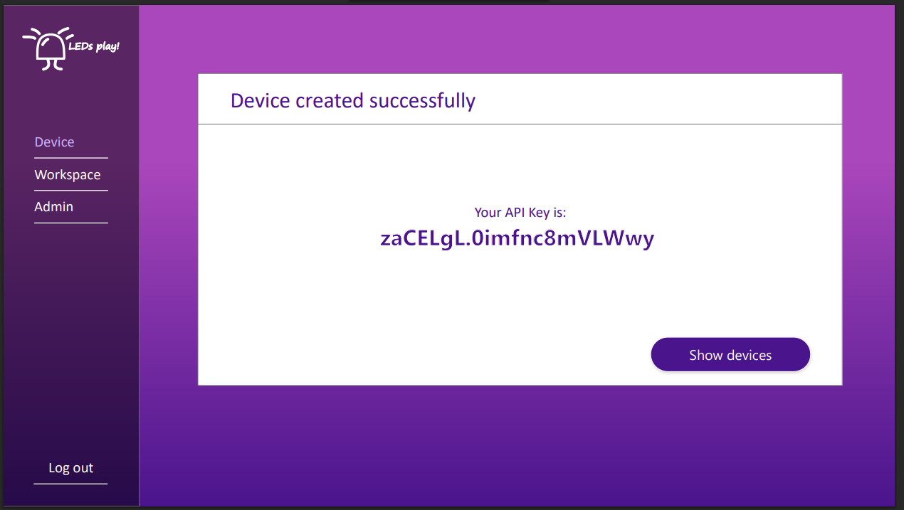
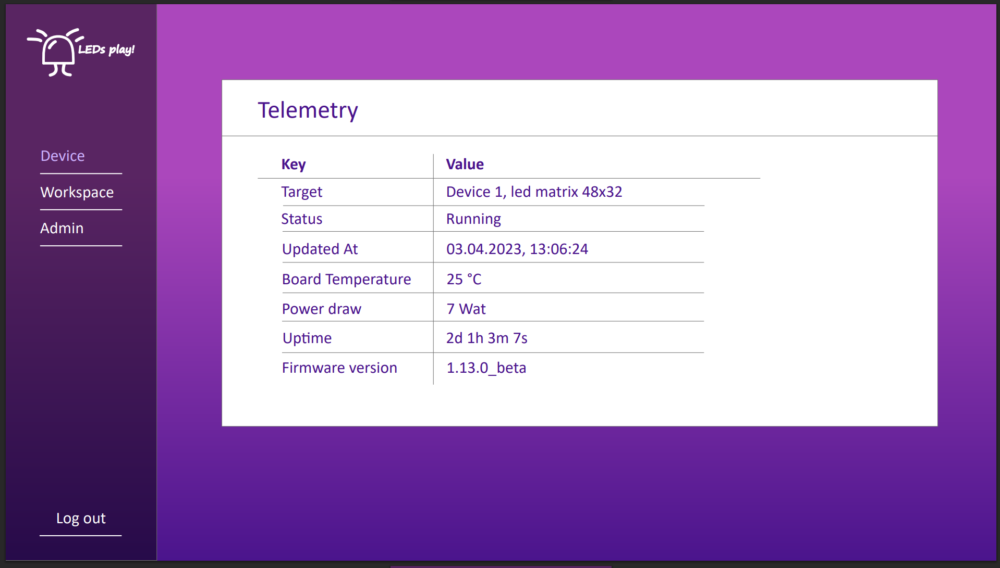
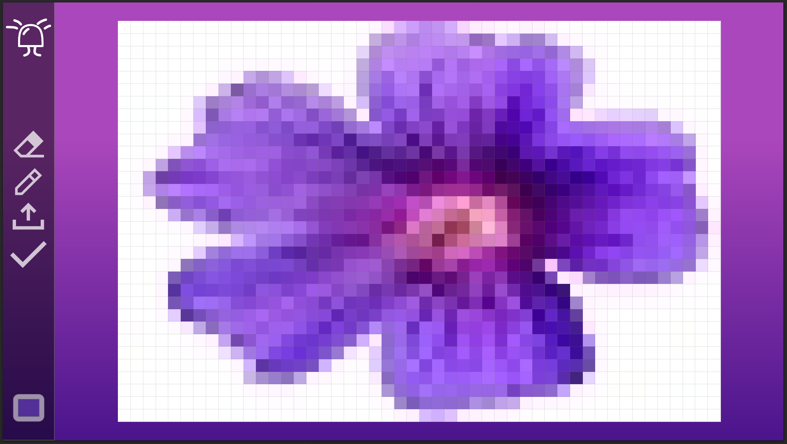

# ez-led-playground

A simple web application for controlling LED matrices directly from your browser.

---

## How to Run

### With Docker
1. Make sure Docker and Docker Compose are installed.  
2. Run:  
   docker-compose up --build  
3. Open in your browser:  
   http://localhost:8000

---

## Screenshots

### Adding device

### Viewing telemetry

### Drawing (this controls LED Diodes IRL)

---